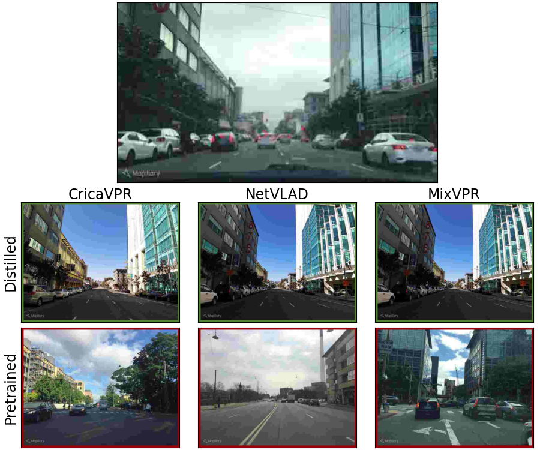
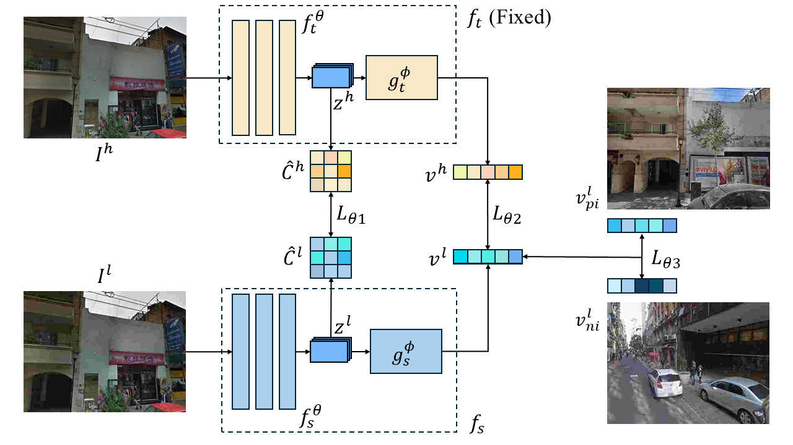

# LoQI-VPR
## VPR for Low Quality Images via Knowledge Distillation

    
    

Implementation for the ICCV 2025 WDFM-AD workshop paper "Distillation Improves Visual Place Recognition for Low Quality Images".

### Setup
1. Clone the repository with submodules: `$ git clone --recurse-submodules https://github.com/ai4ce/LoQI-VPR.git`
2. Install dependencies: `$ conda env create -f environment.yml`
3. Download GSV-Cities dataset from [Kaggle](https://www.kaggle.com/datasets/amaralibey/gsv-cities) and the Pitts250k dataset for validation
4. Download VPR testing datasets using [VPR Datasets Downloader](https://github.com/gmberton/vpr-datasets-downloader)

### Running Experiments
`trainer.yaml` and `test_trained_model.yaml` from `configs` contains the configurations for running distillation and testing VPR methods respectively.

**Training:** `src/trainer_gsv-cities.py` distills VPR models enabled in configurations using the enabled loss functions.

**Testing:** `src/dataset/testing_data.py` precomputes global descriptors for the specified VPR models and datasets selected in configurations. `src/calculate_recall.py` records recall rates to tensorboard log files and a Google Sheet.